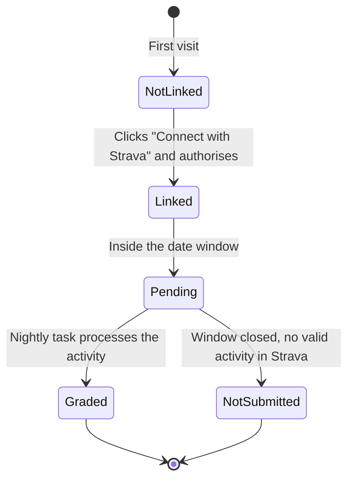
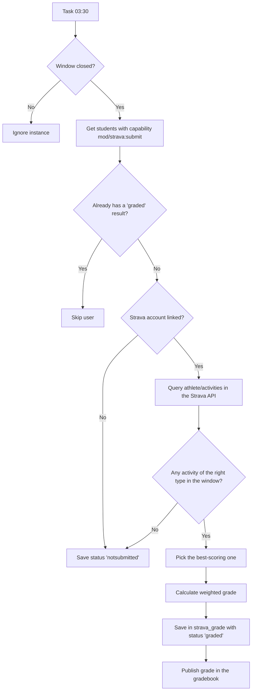

# mod_strava — Strava Challenge for Moodle


Moodle activity module that turns a sporting goal recorded in [Strava](https://www.strava.com) into a **gradable activity** inside a course. Teachers define the challenge parameters (sport type, date, target metrics) and the plugin automatically syncs data from the Strava API to calculate the grade and publish it in the gradebook.

> **Required dependency**: this plugin requires [`local_stravaauth`](../stravaauth/README.md) to be installed and configured first.

*Documentación en español: [README.es.md](README.es.md).*

---

## Table of contents

- [What does this plugin do?](#what-does-this-plugin-do)
- [Requirements and dependencies](#requirements-and-dependencies)
- [Installation](#installation)
- [Challenge configuration (teachers)](#challenge-configuration-teachers)
- [Student view](#student-view)
- [Grading system](#grading-system)
- [Scheduled sync task](#scheduled-sync-task)
- [Manual sync](#manual-sync)
- [Capabilities and roles](#capabilities-and-roles)
- [Database](#database)
- [Privacy and GDPR](#privacy-and-gdpr)
- [Strava API reference](#strava-api-reference)
- [License](#license)

---

## What does this plugin do?

```
┌─────────────────────────────────────────────────────────────────┐
│  TEACHER                                                        │
│  Defines the challenge: activity type, target date,             │
│  metrics (distance, time, speed, elevation) and weights         │
└───────────────────────────┬─────────────────────────────────────┘
                            │ creates a mod_strava instance
                            ▼
┌─────────────────────────────────────────────────────────────────┐
│  STUDENT                                                        │
│  1. Links their Strava account (via local_stravaauth)           │
│  2. Performs the sporting activity on the given date            │
│  3. Uploads the activity to Strava (phone / GPS device)         │
└───────────────────────────┬─────────────────────────────────────┘
                            │ after the date window closes
                            ▼
┌─────────────────────────────────────────────────────────────────┐
│  SCHEDULED TASK (03:30 every night)                             │
│  1. Queries the student's activities in the Strava API          │
│  2. Filters by sport type and date window                       │
│  3. Picks the best-scoring activity                             │
│  4. Calculates the grade weighted by target                     │
│  5. Publishes the grade in the gradebook                        │
└─────────────────────────────────────────────────────────────────┘
```

---

## Requirements and dependencies

| Component | Minimum version | Notes |
|---|---|---|
| Moodle | 4.1 (build 2022112800) | |
| PHP | 8.1 | |
| **local_stravaauth** | 2026091000 | **Required** — handles OAuth2 and the API client |

### Install `local_stravaauth` first

Follow the setup instructions of [`local_stravaauth`](../stravaauth/README.md) (Strava app registration, Client ID and Client Secret) before installing this module.

---

## Installation

```bash
# From the Moodle root
cp -r mod/strava /var/www/html/moodle/mod/strava

# Or via Git
git clone <repo> mod/strava
```

Go to **Site administration → Notifications** to install the database tables (`mdl_strava` and `mdl_strava_grade`).

---

## Challenge configuration (teachers)

To add a Strava Challenge to a course, teachers follow the standard Moodle flow (*Turn editing on → Add an activity or resource → Strava Challenge*) and fill in the form:

### General section

| Field | Description |
|---|---|
| **Name** | Visible name of the challenge in the course |
| **Description** | Explanatory text for students |

### Strava challenge settings

| Field | Description |
|---|---|
| **Activity type** | Sport that counts: Running, Trail Running, Cycling, Mountain Bike, Hiking, Walking, Swimming |
| **Target date** | Exact day on which the student must perform the activity |
| **Tolerance (± days)** | Number of days before/after the target date that are also considered valid (0–7) |
| **If there are several activities** | `Best score` (automatic) or `Student chooses` |

> **Example**: Target date = 15 March, Tolerance = 2 days → valid window from 13 to 17 March.

### Targets and weighting

The challenge can evaluate up to **four metrics** at the same time. Each metric has a **target** and a **weight** (the weights of the active metrics must add up to exactly 100 %):

| Metric | Unit (form) | Internal storage | Target type |
|---|---|---|---|
| **Distance** | km | metres | The more, the better |
| **Time** | minutes | seconds | The less, the better |
| **Average speed** | km/h | m/s | The more, the better |
| **Elevation gain** | metres | metres | The more, the better |

**Example of a valid configuration:**

```
✅ Distance:     10 km   — weight 50 %
✅ Speed:         5 km/h — weight 30 %
✅ Elevation:   200 m    — weight 20 %
                          ────────
                          TOTAL 100 %
```

### Grade

The form includes the standard Moodle grade section. The configurable maximum grade is scaled proportionally to how well the targets are met.

---

## Student view

When opening the activity, the student sees:

1. **Valid window**: start and end dates of the period, and the required activity type.
2. **Strava connection status**: if the account is not linked yet, a *Connect with Strava* button starts the OAuth2 flow of `local_stravaauth`.
3. **Your result**: result status and, once processed, the metric breakdown and final grade.



### Possible result statuses

| Status | Description |
|---|---|
| `pending` | The date window has not closed yet |
| `graded` | Grade calculated and published in the gradebook |
| `notsubmitted` | No activity of the required type was found in the window |

---

## Grading system

The grade is calculated as a **weighted average** of the configured targets:

```
final_grade = Σ (ratio_i × weight_i) / Σ weight_i  ×  max_grade
```

Where `ratio_i` for each metric is:

- **Distance, speed, elevation** (more is better): `min(1.0, actual_value / target)`
- **Time** (less is better): `min(1.0, target / actual_time)`

The ratio is capped at `1.0`: exceeding the target gives no more points than reaching it.

**Calculation example:**

```
Distance target:   10 km   weight 50 %  →  student covers 8 km    →  ratio = 0.80
Speed target:       5 km/h weight 30 %  →  average speed 6 km/h   →  ratio = 1.00 (capped)
Elevation target: 200 m    weight 20 %  →  actual elevation 150 m  →  ratio = 0.75

Grade = (0.80×50 + 1.00×30 + 0.75×20) / 100 × 10
      = (40 + 30 + 15) / 100 × 10
      = 0.85 × 10 = 8.5 / 10
```

If there are several valid activities in the window, the plugin automatically picks the one with the **best score** (`selectionmode = best`).

---

## Scheduled sync task

The `mod_strava\task\sync_activities` task runs automatically every night at **03:30** and processes all instances whose date window has already closed:



The task can be managed from **Site administration → Server → Scheduled tasks**.

---

## Manual sync

Teachers with the `mod/strava:manualsync` capability can force an immediate sync from the activity page itself using the **"Force sync now"** button, without waiting for the nightly task.

---

## Capabilities and roles

| Capability | Description | Default role |
|---|---|---|
| `mod/strava:addinstance` | Add the module to a course | Editing teacher, Manager |
| `mod/strava:view` | View the activity | Student, Teacher, Manager |
| `mod/strava:submit` | Take part in the challenge (be graded) | Student |
| `mod/strava:viewreports` | View the results of all students | Teacher, Manager |
| `mod/strava:manualsync` | Force a manual sync | Editing teacher, Manager |

---

## Database

### `mdl_strava`

Activity instances (one row per challenge added to a course).

| Column | Type | Description |
|---|---|---|
| `id` | INT | Primary key |
| `course` | INT | FK → `mdl_course.id` |
| `name` | VARCHAR(255) | Challenge name |
| `activitytype` | VARCHAR(30) | Strava sport type (`Run`, `Ride`, `Hike`, etc.) |
| `targetdate` | INT | Unix timestamp of the target date |
| `tolerancedays` | INT | Days of tolerance before/after |
| `selectionmode` | VARCHAR(20) | `best` or `choose` |
| `usedistance` | TINYINT | 1 if distance is enabled |
| `distancetarget` | INT | Target distance in metres |
| `distanceweight` | INT | Distance target weight (0–100) |
| `useduration` | TINYINT | 1 if time is enabled |
| `durationtarget` | INT | Target time in seconds |
| `durationweight` | INT | Time target weight (0–100) |
| `usespeed` | TINYINT | 1 if speed is enabled |
| `speedtarget` | FLOAT | Target speed in m/s |
| `speedweight` | INT | Speed target weight (0–100) |
| `useelevation` | TINYINT | 1 if elevation is enabled |
| `elevationtarget` | INT | Target elevation gain in metres |
| `elevationweight` | INT | Elevation target weight (0–100) |
| `grade` | FLOAT | Moodle maximum grade |

### `mdl_strava_grade`

Calculated result per student and instance.

| Column | Type | Description |
|---|---|---|
| `id` | INT | Primary key |
| `stravaid` | INT | FK → `mdl_strava.id` |
| `userid` | INT | FK → `mdl_user.id` |
| `stravaactivityid` | INT | Activity ID in Strava |
| `sporttype` | VARCHAR(30) | Sport type of the chosen activity |
| `distance` | FLOAT | Actual distance in metres |
| `movingtime` | INT | Moving time in seconds |
| `averagespeed` | FLOAT | Average speed in m/s |
| `elevationgain` | FLOAT | Elevation gain in metres |
| `rawgrade` | FLOAT | Calculated grade |
| `breakdown` | TEXT | JSON with the per-target breakdown |
| `status` | VARCHAR(20) | `pending`, `graded` or `notsubmitted` |

---

## Privacy and GDPR

The plugin implements `\core_privacy\local\metadata\provider` and declares:

- **`strava_grade`**: each student's sporting activity data (distance, time, speed, elevation) and the calculated grade.
- **External data**: the user's activities are queried from the Strava API; authentication is handled entirely by `local_stravaauth`.

---

## Strava API reference

This plugin consumes the `GET /athlete/activities` endpoint of the Strava API v3. For more information:

- **Developer portal**: [https://developers.strava.com/](https://developers.strava.com/)
- **Full API v3 reference**: [https://developers.strava.com/docs/reference/](https://developers.strava.com/docs/reference/)
  - Endpoint used: [`GET /athlete/activities`](https://developers.strava.com/docs/reference/#api-Activities-getLoggedInAthleteActivities)
- **Create and manage your application**: [https://www.strava.com/settings/api](https://www.strava.com/settings/api)

---

## License

GNU GPL v3 or later — see the `LICENSE` file or visit [gnu.org/licenses/gpl-3.0](https://www.gnu.org/licenses/gpl-3.0.html).
