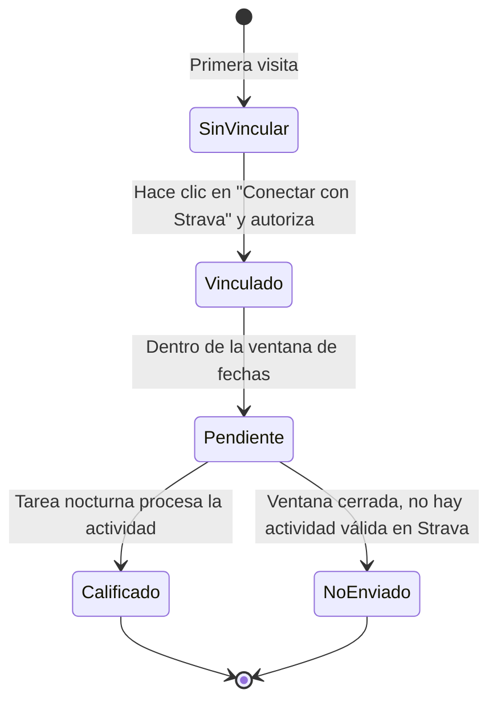
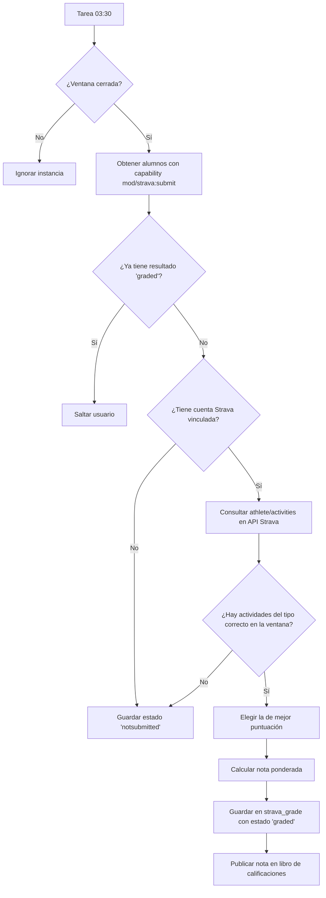

# mod_strava — Reto Strava para Moodle


Módulo de actividad de Moodle que convierte un objetivo deportivo registrado en [Strava](https://www.strava.com) en una **actividad calificable** dentro de un curso. El profesorado define los parámetros del reto (tipo de deporte, fecha, métricas objetivo) y el plugin sincroniza automáticamente los datos desde la API de Strava para calcular y publicar la nota en el libro de calificaciones.

> **Dependencia obligatoria**: este plugin requiere que [`local_stravaauth`](../stravaauth/README.md) esté instalado y configurado previamente.

---

## Índice

- [¿Qué hace este plugin?](#qué-hace-este-plugin)
- [Requisitos y dependencias](#requisitos-y-dependencias)
- [Instalación](#instalación)
- [Configuración del reto (profesorado)](#configuración-del-reto-profesorado)
- [Vista del alumno/a](#vista-del-alumnoa)
- [Sistema de calificación](#sistema-de-calificación)
- [Tarea programada de sincronización](#tarea-programada-de-sincronización)
- [Sincronización manual](#sincronización-manual)
- [Capacidades y roles](#capacidades-y-roles)
- [Base de datos](#base-de-datos)
- [Privacidad y RGPD](#privacidad-y-rgpd)
- [Referencia de la API de Strava](#referencia-de-la-api-de-strava)

---

## ¿Qué hace este plugin?

```
┌─────────────────────────────────────────────────────────────────┐
│  PROFESOR/A                                                     │
│  Define el reto: tipo de actividad, fecha objetivo,            │
│  métricas (distancia, tiempo, velocidad, desnivel) y pesos     │
└───────────────────────────┬─────────────────────────────────────┘
                            │ crea instancia mod_strava
                            ▼
┌─────────────────────────────────────────────────────────────────┐
│  ALUMNO/A                                                       │
│  1. Vincula su cuenta de Strava (via local_stravaauth)          │
│  2. Realiza la actividad deportiva en la fecha indicada         │
│  3. Sube la actividad a Strava (desde su móvil/dispositivo GPS) │
└───────────────────────────┬─────────────────────────────────────┘
                            │ después del cierre de la ventana
                            ▼
┌─────────────────────────────────────────────────────────────────┐
│  TAREA PROGRAMADA (03:30 cada noche)                           │
│  1. Consulta actividades del alumno/a en la API de Strava      │
│  2. Filtra por tipo de deporte y ventana de fechas             │
│  3. Elige la actividad de mejor puntuación                     │
│  4. Calcula la nota ponderada por objetivos                    │
│  5. Publica la nota en el libro de calificaciones              │
└─────────────────────────────────────────────────────────────────┘
```

---

## Requisitos y dependencias

| Componente | Versión mínima | Notas |
|---|---|---|
| Moodle | 4.1 (build 2022112800) | |
| PHP | 8.1 | |
| **local_stravaauth** | 2026091000 | **Obligatorio** — gestiona OAuth2 y el cliente de API |

### Instalar `local_stravaauth` primero

Sigue las instrucciones de configuración de [`local_stravaauth`](../stravaauth/README.md) (registro de la app en Strava, Client ID y Client Secret) antes de instalar este módulo.

---

## Instalación

```bash
# Desde la raíz de Moodle
cp -r mod/strava /var/www/html/moodle/mod/strava

# O mediante Git
git clone <repo> mod/strava
```

Accede a **Administración del sitio → Notificaciones** para instalar las tablas de base de datos (`mdl_strava` y `mdl_strava_grade`).

---

## Configuración del reto (profesorado)

Para añadir un Reto Strava en un curso, el profesorado sigue el flujo estándar de Moodle (*Activar edición → Añadir actividad → Reto Strava*) y rellena el formulario:

### Sección general

| Campo | Descripción |
|---|---|
| **Nombre** | Nombre visible del reto en el curso |
| **Descripción** | Texto explicativo para el alumnado |

### Configuración del reto Strava

| Campo | Descripción |
|---|---|
| **Tipo de actividad** | Deporte que cuenta: Running, Trail Running, Ciclismo, MTB, Senderismo, Caminar, Natación |
| **Fecha objetivo** | Día exacto en el que el alumno/a debe realizar la actividad |
| **Tolerancia (± días)** | Margen de días antes/después de la fecha objetivo que también se consideran válidos (0–7) |
| **Si hay varias actividades** | `Mejor puntuación` (automático) o `El alumno elige` |

> **Ejemplo**: Fecha objetivo = 15 marzo, Tolerancia = 2 días → ventana válida del 13 al 17 de marzo.

### Objetivos y ponderación

El reto puede evaluar hasta **cuatro métricas** de forma simultánea. Cada métrica tiene un **objetivo** y un **peso** (los pesos de las métricas activas deben sumar exactamente 100 %):

| Métrica | Unidad (formulario) | Almacenamiento interno | Tipo de objetivo |
|---|---|---|---|
| **Distancia** | km | metros | Cuanto más, mejor |
| **Tiempo** | minutos | segundos | Cuanto menos, mejor |
| **Velocidad media** | km/h | m/s | Cuanto más, mejor |
| **Desnivel positivo** | metros | metros | Cuanto más, mejor |

**Ejemplo de configuración válida:**

```
✅ Distancia:    10 km   — peso 50 %
✅ Velocidad:     5 km/h — peso 30 %
✅ Desnivel:    200 m    — peso 20 %
                          ────────
                          TOTAL 100 %
```

### Calificación

El formulario incluye la sección estándar de calificación de Moodle. La nota máxima configurable se traduce proporcionalmente al grado de cumplimiento de los objetivos.


*(captura del formulario de creación del reto)*

---

## Vista del alumno/a

Al acceder a la actividad, el alumno/a ve:

1. **Ventana válida**: fechas de inicio y fin del periodo, y tipo de actividad requerido.
2. **Estado de conexión con Strava**: si aún no ha vinculado su cuenta, aparece un botón *Conectar con Strava* que inicia el flujo OAuth2 de `local_stravaauth`.
3. **Tu resultado**: estado del resultado y, una vez procesado, desglose de métricas y nota final.



### Estados posibles del resultado

| Estado | Descripción |
|---|---|
| `pending` | La ventana de fechas aún no ha cerrado |
| `graded` | Nota calculada y publicada en el libro de calificaciones |
| `notsubmitted` | No se encontró ninguna actividad del tipo requerido en la ventana |

---

## Sistema de calificación

La nota se calcula de forma **ponderada** según los objetivos configurados:

```
nota_final = Σ (ratio_i × peso_i) / Σ peso_i  ×  nota_máxima
```

Donde `ratio_i` para cada métrica es:

- **Distancia, velocidad, desnivel** (más es mejor): `min(1.0, valor_real / objetivo)`
- **Tiempo** (menos es mejor): `min(1.0, objetivo / tiempo_real)`

El ratio se satura en `1.0`: superar el objetivo no da más puntos que alcanzarlo.

**Ejemplo de cálculo:**

```
Objetivo distancia:  10 km  peso 50 %  →  el alumno recorre 8 km  →  ratio = 0.80
Objetivo velocidad:   5 km/h peso 30 %  →  velocidad media 6 km/h  →  ratio = 1.00 (saturado)
Objetivo desnivel:  200 m   peso 20 %  →  desnivel real  150 m    →  ratio = 0.75

Nota = (0.80×50 + 1.00×30 + 0.75×20) / 100 × 10
     = (40 + 30 + 15) / 100 × 10
     = 0.85 × 10 = 8.5 / 10
```

Si hay varias actividades válidas en la ventana, el plugin elige automáticamente la de **mejor puntuación** (`selectionmode = best`).

---

## Tarea programada de sincronización

La tarea `mod_strava\task\sync_activities` se ejecuta automáticamente cada noche a las **03:30** y procesa todas las instancias cuya ventana de fechas ya ha cerrado:



La tarea puede gestionarse desde **Administración del sitio → Servidor → Tareas programadas**.

---

## Sincronización manual

El profesorado con la capacidad `mod/strava:manualsync` puede forzar una sincronización inmediata desde la propia página de la actividad mediante el botón **"Forzar sincronización ahora"**, sin esperar a la tarea nocturna.

---

## Capacidades y roles

| Capacidad | Descripción | Rol por defecto |
|---|---|---|
| `mod/strava:addinstance` | Añadir el módulo a un curso | Profesor editor, Gestor |
| `mod/strava:view` | Ver la actividad | Estudiante, Profesor, Gestor |
| `mod/strava:submit` | Participar en el reto (ser evaluado) | Estudiante |
| `mod/strava:viewreports` | Ver los resultados de todos los alumnos | Profesor, Gestor |
| `mod/strava:manualsync` | Forzar sincronización manual | Profesor editor, Gestor |

---

## Base de datos

### `mdl_strava`

Instancias de la actividad (una fila por reto añadido en un curso).

| Columna | Tipo | Descripción |
|---|---|---|
| `id` | INT | Clave primaria |
| `course` | INT | FK → `mdl_course.id` |
| `name` | VARCHAR(255) | Nombre del reto |
| `activitytype` | VARCHAR(30) | Tipo de deporte Strava (`Run`, `Ride`, `Hike`, etc.) |
| `targetdate` | INT | Unix timestamp de la fecha objetivo |
| `tolerancedays` | INT | Días de margen antes/después |
| `selectionmode` | VARCHAR(20) | `best` o `choose` |
| `usedistance` | TINYINT | 1 si la distancia está activa |
| `distancetarget` | INT | Distancia objetivo en metros |
| `distanceweight` | INT | Peso del objetivo distancia (0–100) |
| `useduration` | TINYINT | 1 si el tiempo está activo |
| `durationtarget` | INT | Tiempo objetivo en segundos |
| `durationweight` | INT | Peso del objetivo tiempo (0–100) |
| `usespeed` | TINYINT | 1 si la velocidad está activa |
| `speedtarget` | FLOAT | Velocidad objetivo en m/s |
| `speedweight` | INT | Peso del objetivo velocidad (0–100) |
| `useelevation` | TINYINT | 1 si el desnivel está activo |
| `elevationtarget` | INT | Desnivel objetivo en metros |
| `elevationweight` | INT | Peso del objetivo desnivel (0–100) |
| `grade` | FLOAT | Nota máxima de Moodle |

### `mdl_strava_grade`

Resultado calculado por alumno/a e instancia.

| Columna | Tipo | Descripción |
|---|---|---|
| `id` | INT | Clave primaria |
| `stravaid` | INT | FK → `mdl_strava.id` |
| `userid` | INT | FK → `mdl_user.id` |
| `stravaactivityid` | INT | ID de la actividad en Strava |
| `sporttype` | VARCHAR(30) | Tipo de deporte de la actividad elegida |
| `distance` | FLOAT | Distancia real en metros |
| `movingtime` | INT | Tiempo en movimiento en segundos |
| `averagespeed` | FLOAT | Velocidad media en m/s |
| `elevationgain` | FLOAT | Desnivel positivo en metros |
| `rawgrade` | FLOAT | Nota calculada |
| `breakdown` | TEXT | JSON con el desglose por objetivo |
| `status` | VARCHAR(20) | `pending`, `graded` o `notsubmitted` |

---

## Privacidad y RGPD

El plugin implementa `\core_privacy\local\metadata\provider` y declara:

- **`strava_grade`**: datos de la actividad deportiva (distancia, tiempo, velocidad, desnivel) y la nota calculada de cada alumno/a.
- **Datos externos**: se consultan actividades del usuario/a en la API de Strava; la autenticación es gestionada completamente por `local_stravaauth`.

---

## Referencia de la API de Strava

Este plugin consume el endpoint `GET /athlete/activities` de la API v3 de Strava. Para más información:

- **Portal de desarrolladores**: [https://developers.strava.com/](https://developers.strava.com/)
- **Referencia completa de la API v3**: [https://developers.strava.com/docs/reference/](https://developers.strava.com/docs/reference/)
  - Endpoint usado: [`GET /athlete/activities`](https://developers.strava.com/docs/reference/#api-Activities-getLoggedInAthleteActivities)
- **Crear y gestionar tu aplicación**: [https://www.strava.com/settings/api](https://www.strava.com/settings/api)

---

## Licencia

GNU GPL v3 — consulta el fichero `LICENSE` o visita [gnu.org/licenses/gpl-3.0](https://www.gnu.org/licenses/gpl-3.0.html).
